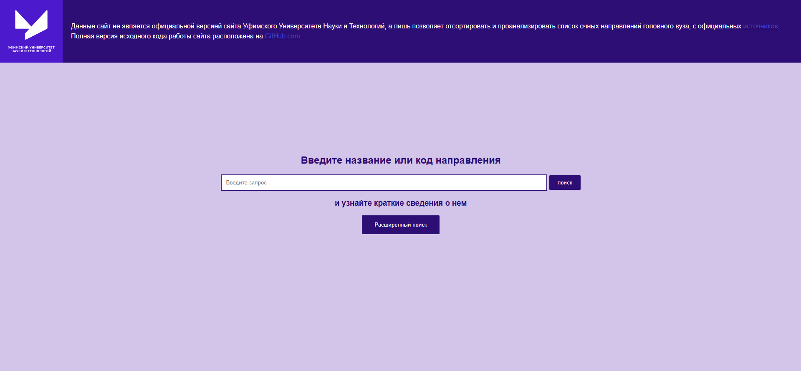
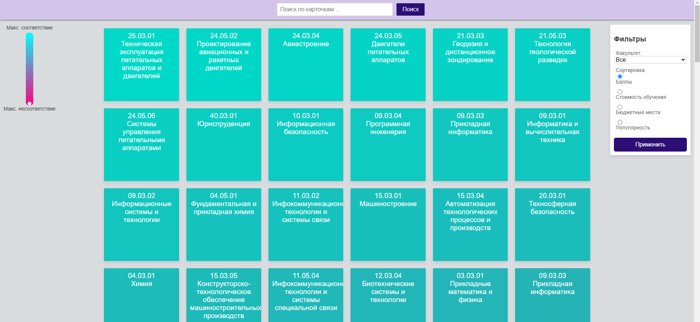

# WaUust
## Описание проекта:
1. Данный проект предназначен для быстрого анализа направлений Уфимского Университета Науки и Технологий (УУНиТ), путем парсинга оригинального [сайта](https://uust.ru/)
2. Представленная информация анализируется и сортируется по таким критериям как: популярность, средний проходной балл, 
минимальный походной балл, стоимость обучения.
3. Есть возможность быстрого поиска на главной странице сайта по ключевым словам, таким как название направления или код направления
## Инструкция по навигации

В верхней колонке представлена краткая информация о сайте и используемых источниках парсинга,
Кнопка поиск представляет пользователю краткую информацию о найденных направлениях
Кнопка "расширенный поиск" перекидывает пользователя на отдельную страницу

В верхней части страницы есть поле ввода и поиска по названию карточек, на переднем плане представлены сами карточки, отсортированные с соответствующими условиями.
Цвет карточек зависит от степени несоответствия с выбранными фильтрами.
Слева от карточек показана шкала, где мы сейчас находимся на сайте и какого цвета означаются соответствующие карточки.
Справа расположен фильтр-бар, где пользователь может выбрать уровень сортировки и выбрать факультет по которому будет составлена сортировка.
## Поднятие сайта
### Windows
Вы должны иметь предустановленный Docker, далее перейдите с помощью командной строки к корню приложения и запустите команды в следующем порядке
1. docker-compose build
2. docker-compose up

Если вы до этого запускали данное приложение, перед указанными командами введите

docker-compose down

### Linux
1. Добавьте баш-скрипт uust_up.sh в список существующих скриптов: chmod +x uust_up.sh
2. запустите скрипт командой ./uust_up.sh
